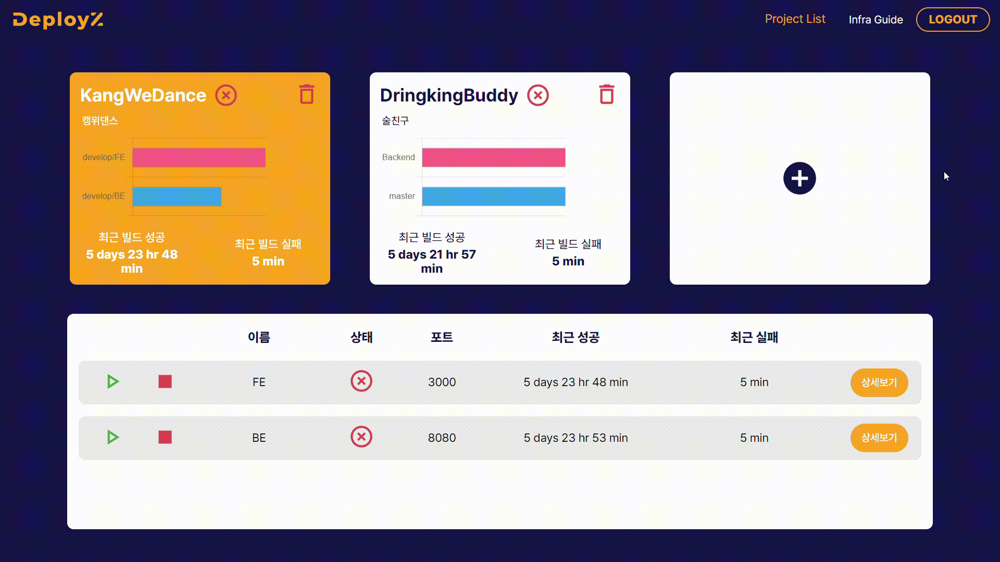

# 개발자들을 위한 자동 배포 솔루션, 디플로이지(Deployz)

**디플로이지는 개발자들이 GUI 환경에서 간단한 옵션 설정만으로 빠르고 편리하게 서비스를 배포할 수 있도록 제공하는 오픈소스 솔루션입니다.**

## 주요기능

- **GUI 설정 환경 제공:** GUI 환경에서 간단한 옵션 설정으로 서비스를 배포할 수 있습니다.
- **사용자 가이드 제공:** 솔루션을 처음 사용하는 사용자들을 위해 [사용자 가이드](https://deployz.co.kr) 사이트를 제공합니다.
- **자동 배포 기능 제공:** 사용자들이 자신들의 서비스에 신속하고 능률적으로 새로운 기능을 적용할 수 있도록 자동배포 환경설정을 제공합니다.
- **배포 현황 시각화:** 대시보드를 통해 사용자들이 자신의 서비스의 배포상태를 쉽게 확인할 수 있습니다.

## Git Convention

- Git 컨벤션은 [Git-Convention](./docs/GitConvention.md)을 참고해주세요.

## Jira Convention

- Jira 컨벤션은 [Jira-Convention](./docs/JiraConvention.md)을 참고해주세요.

## 오픈소스 참여하기

- Deployz는 오픈소스이며 모든 개발자들이 프로젝트에 Contribution 하는 것을 환영합니다. Contribution 방법은 [Contribution-Guide](./docs/ContributionGuide.md)를 참고해 주세요.
- 오픈소스에 참여하기전 커뮤니티 규정인 [Contributor-Covernant](./docs/ContributorCovernant.md)를 확인 후 참여해주세요.

## 뷰

### 랜딩 페이지

### 인프라 가이드

### 프로젝트 생성

### 프로젝트 리스트 및 빌드

## 기술 스택

### FrontEnd

| 
 | 
 | 
 |
| :----------------------------------------------------------------------------------------------: | :--------------------------------------------------------------------------------------------: | :--------------------------------------------------------------------------------------------------: |
|                            &nbsp;&nbsp;&nbsp;HTML5&nbsp;&nbsp;&nbsp;                             |                      &nbsp;&nbsp;&nbsp;&nbsp;CSS3&nbsp;&nbsp;&nbsp;&nbsp;                      |                                  &nbsp;&nbsp;TypeScript&nbsp;&nbsp;                                  |

| 
 | 
 | 
 |
| :------------------------------------------------------------------------------------------------: | :---------------------------------------------------------------------------------------------------: | :---------------------------------------------------------------------------------------------------------------------: |
|                             &nbsp;&nbsp;&nbsp;React&nbsp;&nbsp;&nbsp;                              |                                                Recoil                                                 |                                              &nbsp;Styled-Components&nbsp;                                              |

| 
 | 
 |
| :----------------------------------------------------------------------------------------------------: | :-------------------------------------------------------------------------------------------------: |
|                                            &nbsp;Vite&nbsp;                                            |                                                AXIOS                                                |

### BackEnd

| 
 
 | 
 
 | 

 | 

 |
| :-----------------------------------------------------------------------------------------------------: | :-----------------------------------------------------------------------------------------------------------------: | :-------------------------------------------------------------------------------------------------------------------------: | :------------------------------------------------------------------------------------------------------------: |
|                                                  Java                                                   |                                                     Spring-Boot                                                     |                                                       Spring-Security                                                       |                                           &nbsp;SpringDataJPA&nbsp;                                            |

| 
 
 | 

 |
| :-------------------------------------------------------------------------------------------------------: | :-----------------------------------------------------------------------------------------------------------: |
|                                                   MySQL                                                   |                                                    Swagger                                                    |

 

### DevOps

| 
 
 | 

 | 

 | 

 |
| :---------------------------------------------------------------------------------------------------------: | :----------------------------------------------------------------------------------------------------------: | :------------------------------------------------------------------------------------------------------: | :--------------------------------------------------------------------------------------------------: |
|                                                   Docker                                                    |                                             &nbsp;Jenkins&nbsp;                                              |                                      &nbsp;&nbsp;NginX&nbsp;&nbsp;                                       |                                            &nbsp;AWS EC2                                             |
